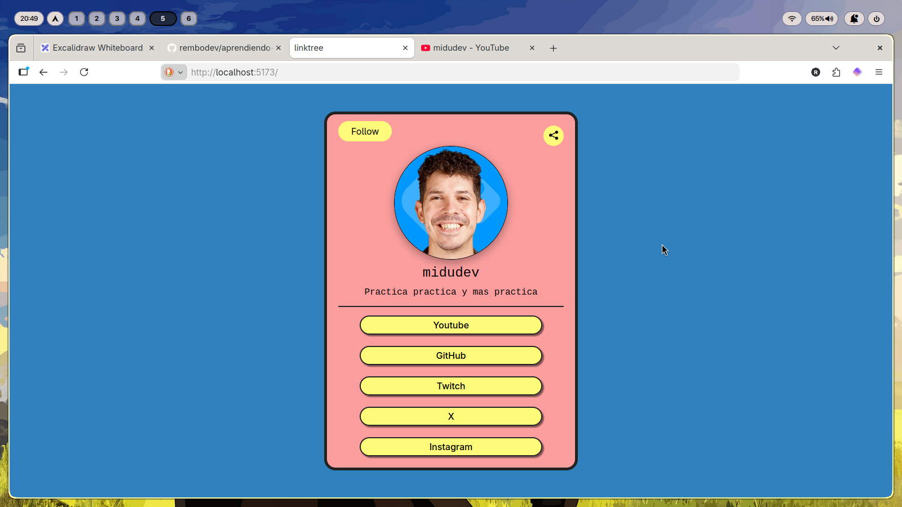
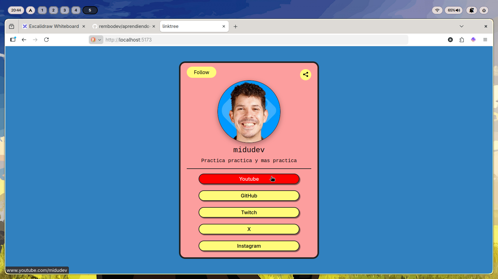
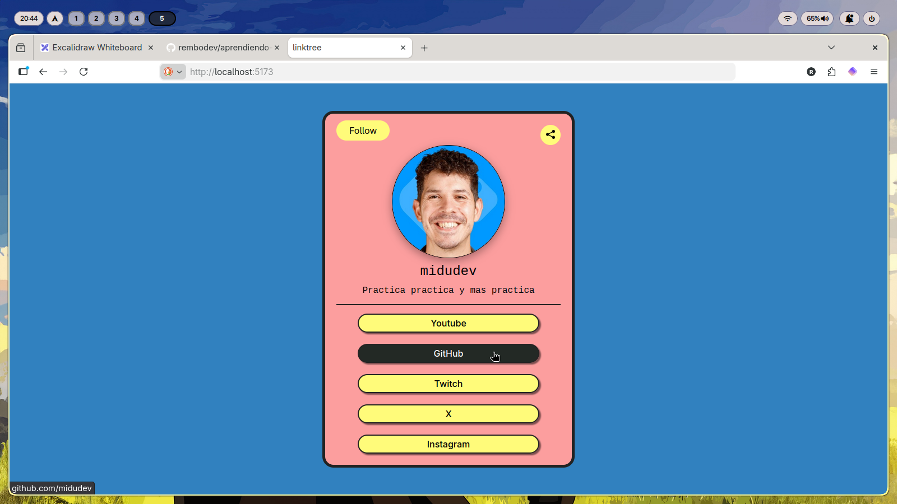
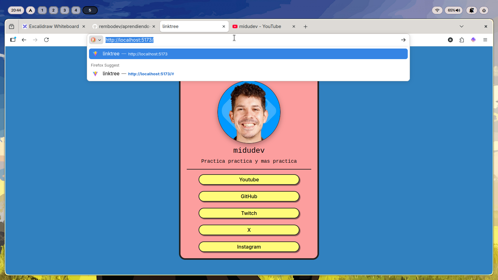
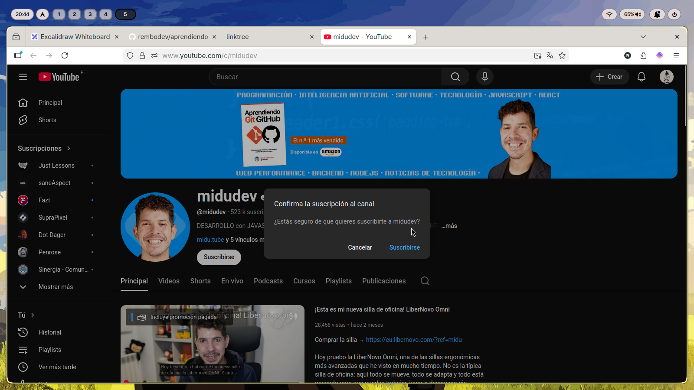

# 🌳 Linktree Clone | Proyecto 02

Este es mi **segundo proyecto** en mi camino de aprendizaje con **React**. Tras completar un primer proyecto guiado por el curso de **Midudev**, decidí lanzarme a crear este Linktree de forma independiente para poner a prueba lo aprendido y añadir funcionalidades extra.

---

## Lo que aprendí y apliqué

### 1. Gestión Dinámica de Estilos (Hover)
En lugar de crear una clase de CSS por cada red social, utilicé un **objeto de configuración de colores** en JavaScript. 
* Pasé el nombre del sitio como `prop`.
* Utilicé ese nombre como clave para extraer el color del objeto.
* Apliqué una variable de CSS dinámica (`--hover-color`) para que el botón sepa qué color mostrar al hacer hover.

### 2. Botón de Suscripción Inteligente
El botón **Follow** no solo redirige al canal, sino que incluye el parámetro de confirmación de suscripción de YouTube, mejorando la interacción del usuario.

### 3. API de Portapapeles y Try/Catch
Para el botón de compartir, implementé la lógica de copiado de URL:
* Uso de `navigator.clipboard.writeText`.
* Implementación de bloques `try...catch` para manejar posibles errores del navegador y asegurar que la aplicación no se rompa.

### 4. Arquitectura con Vite + SWC
Configuré el entorno usando **Vite** con el compilador **SWC** para obtener tiempos de respuesta instantáneos durante el desarrollo.

---

## Tecnologías

* **React 18**
* **JavaScript (ES6+)**
* **Vite**
* **CSS3** (Flexbox y variables dinámicas)

---

## 📸 Imagenes del Trabajo

---
Inspirado en midudev

